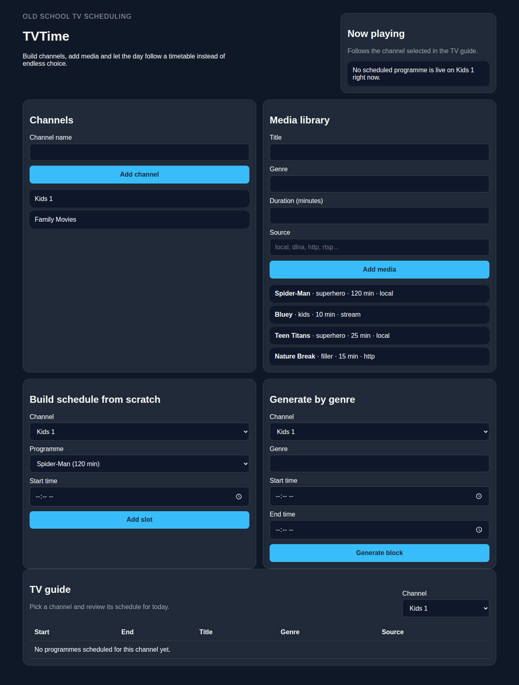
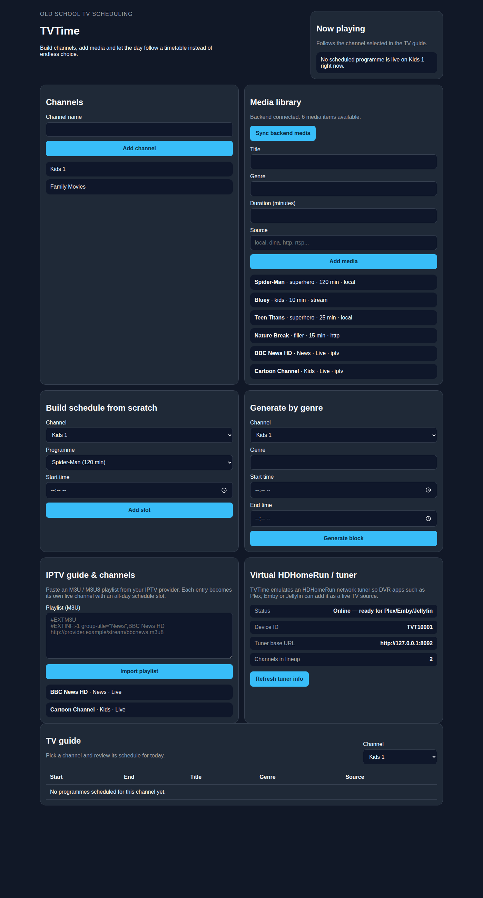

# TVTime

TVTime is a low-dependency web app prototype for building "old school TV" schedules from your own media library.



TVTime also supports importing IPTV playlists as live channels and can emulate
an HDHomeRun network tuner for DVR software such as Plex, Emby or Jellyfin:



## What is in this repository today?

This first cut keeps dependencies at zero:

- plain HTML, CSS and JavaScript
- no framework
- no build step
- no package manager setup

The prototype lets you:

- create multiple channels
- add media entries with a title, genre, duration and source
- build a schedule from scratch
- generate a schedule window from a chosen genre
- view a TV guide and "now playing" summary in the browser
- **watch channels with the built-in HTML5 video player**
- **discover DLNA/UPnP media servers on your network**
- **import IPTV M3U playlists as live channels with an always-on guide slot**
- **expose the backend as a virtual HDHomeRun tuner for DVR apps**

All data is stored locally in `localStorage`, which keeps the initial project easy to understand and easy to evolve.

## Recommended architecture

Because the long-term product needs scheduling, media metadata, local streams and eventually external integrations, a backend-first architecture is a good fit.

### Phase 1: zero-dependency prototype

- **Frontend:** stock HTML/CSS/JS
- **Backend:** none yet
- **Storage:** browser `localStorage`
- **Goal:** validate the guide UX, channel model and scheduling workflow

### Phase 2: minimal C++ backend

Recommended direction: **C++ backend with minimal dependencies**.

- serve the static frontend directly from the backend
- expose a small JSON API for channels, media, schedules and playback state
- start with file-based persistence or SQLite
- keep the frontend framework-free unless the UI complexity proves otherwise

Suggested backend responsibilities:

- media library indexing
- schedule generation rules
- guide publishing
- stream URL validation
- user/account configuration
- parental and channel restrictions

### Phase 3: integrations

Add source plugins behind clear interfaces:

- local files ✓
- DLNA discovery ✓ (basic SSDP discovery implemented)
- HTTP/RTSP streams
- later: provider/import integrations where legally and technically appropriate

**Note:** The current DLNA implementation includes basic device discovery using SSDP (Simple Service Discovery Protocol). Full DLNA content browsing would require additional XML and SOAP parsing capabilities.

### Phase 4: playback targets

- web player ✓ (HTML5 video player with streaming support)
- lightweight device apps that reuse the same guide API
- future experimental output layers such as DVB-T hardware tooling

## Why this approach?

It matches the project goals:

- **few dependencies**
- **backend-friendly design**
- **simple frontend**
- **incremental path from prototype to real scheduler**

## Running TVTime

From the repository root:

```bash
python3 -m http.server 8000
```

Then open <http://localhost:8000>. This browser-only mode stores data in
`localStorage` and skips backend media discovery.

## Running the C++ backend

The backend builds with CMake, serves the static frontend from the repository
root and exposes JSON endpoints for health, source plugins and discovered local
videos. The frontend can sync discovered videos from `GET /api/videos`; files
without metadata receive a default 30 minute duration that you can adjust by
adding media manually.

```bash
cmake -S . -B build
cmake --build build
./build/tvtime_server . ./media
```

Then open <http://127.0.0.1:8080>. Set `TVTIME_PORT` to choose another port or
`TVTIME_HOST=0.0.0.0` when exposing the server to other devices.

Current API endpoints:

- `GET /api/health`
- `GET /api/sources`
- `GET /api/videos`
- `GET /api/stream/{video_id}` - Stream video content for playback, or redirect
  to the origin URL for remote sources such as IPTV streams
- `GET /api/schedule` - list all scheduled program slots, or pass
  `?channel=<name>` to filter to a single channel
- `GET /api/schedule/now?channel=<name>` - the slot playing now on a channel
  (optionally pass `&minute=<0-1439>` to check a specific minute of the day
  instead of the server's current local time)
- `POST /api/schedule` - add a slot with a JSON body of
  `{"channel": "...", "videoId": "...", "startMinute": 0, "endMinute": 30}`
  (`startMinute`/`endMinute` count minutes since midnight). Returns `409` on
  an overlapping slot or `422` for an invalid time range.

The schedule is persisted to a small tab-separated file (`schedule.tsv` in the
media directory by default, or the path in `TVTIME_SCHEDULE_FILE`) so slots
added through the API survive a server restart.

The frontend now keeps this backend schedule in sync automatically: manual
slots, generated genre blocks and IPTV all-day slots are pushed to
`/api/schedule` as soon as they are created, and the guide pulls
`GET /api/schedule` on load (and whenever you click "Sync backend media") to
merge in any slots created elsewhere (another browser, a script, or a
previous session with a running backend). When the backend is unreachable,
TVTime falls back to `localStorage` only, so the browser-only workflow keeps
working unchanged.

## IPTV guide and channels

TVTime can import standard [M3U/M3U8](https://en.wikipedia.org/wiki/M3U)
playlists (the format used by virtually every IPTV provider) as live
channels:

- **Frontend:** paste playlist text into the "IPTV guide & channels" card.
  Each `#EXTINF` entry becomes its own channel with an all-day "live" slot in
  the TV guide, grouped by its `group-title` attribute as the genre.
- **Backend:** drop an `iptv.m3u` file into the media directory passed to
  `tvtime_server` (or point `TVTIME_IPTV_M3U` at any file path) and restart the
  server. Discovered channels are merged into `GET /api/videos` automatically
  and appear after using "Sync backend media" in the frontend.

## Virtual HDHomeRun / TV headend

The backend emulates the JSON API exposed by [HDHomeRun](https://www.silicondust.com/)
network tuners, so TVTime can be added as a live TV source to DVR software
such as Plex, Emby and Jellyfin (using "add device by IP/manual" tuner setup):

- `GET /discover.json` - device identification (`DeviceID`, `TunerCount`, `BaseURL`, ...)
- `GET /lineup.json` - the tunable channel lineup, built from every video with
  a URI in the library (IPTV channels are the primary use case, but local and
  DLNA sources are included too)
- `GET /lineup_status.json` - scan status expected by HDHomeRun clients

Point your DVR software at the TVTime server's IP address and port to add it
as a tuner; no physical hardware is required.

## Running with Docker

The included container is intended for NAS installs and other always-on home
servers. It builds the C++ backend, serves the frontend and indexes media mounted
at `/media`.

```bash
docker compose up -d --build
```

By default, `docker-compose.yml` publishes TVTime at <http://localhost:8080> and
mounts `./media` read-only. On a NAS, replace `./media` with the absolute path to
your video share, for example:

```yaml
volumes:
  - /volume1/video:/media:ro
```

Supported discovered file types are `.mp4`, `.mkv`, `.avi`, `.mov` and `.webm`.

## Next backend milestones

1. move browser state into the C++ service ✓ (the frontend now syncs
   schedule slots to/from `/api/schedule` in addition to media; channels and
   raw media metadata still live in `localStorage`)
2. add persistent media and schedule storage ✓ (schedule persistence and
   `/api/schedule` endpoints implemented; media library indexing was already
   in place)
3. separate scheduling rules from UI logic ✓ (overlap/range validation now
   lives in the backend `Schedule` class behind `/api/schedule`)
4. add playback endpoints and source adapters ✓ (`/api/stream/{video_id}`)
5. add authentication only when multi-user support is needed
